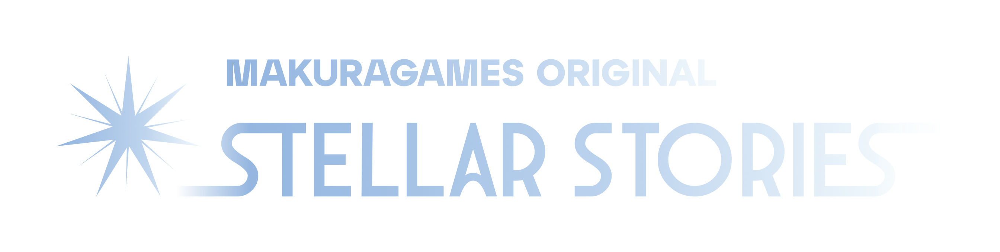

  

🌐 **Read this in other languages:**

- 🇺🇸 [English](README.en.md)
- 🇷🇺 [Русский](README.ru.md)

# Stellar Stories

**Stellar Stories** — уникальная ролевая игра, вдохновленная культовой классикой **Space Station 13** и ставшая следующим шагом в развитии **Space Station 14**. Вас ждут веселье и хаос в самых разных сеттингах: от космической станции и Фонда SCP до Средневековья и морских баталий.

На первый взгляд игра может показаться сложной — и это действительно так. Но мы поможем тебе освоиться и найти в ней свое место.

Игра работает на базе открытого игрового движка [Robust Toolbox](https://github.com/space-wizards/RobustToolbox), разработанного на C#.

## Документация

На [сайте с документацией Space Station 14](https://docs.spacestation14.io/) имеется вся необходимая информация о контенте SS14, движке, дизайне игры и многом другом. Наша игра наследует большую часть подобных моментов из Space Station 14, поэтому вы можете смело обращаться к нему. Там также представлено множество полезных материалов для начинающих разработчиков.

## Активность проекта
<!---
ТУТ ИЗМЕНИТЬ НА СВОЁ АПИ С САЙТА repobeats.axiom.co  СЕЙЧАС ЭТО СТАТИСТИКА МОЕГО РЕПОЗИТОРИЯ!!!!!!!!!!!!!!!!!!!!
--->

## Участники проекта

Список людей, внесших вклад в проект:

---

## Лицензия

> [!CAUTION]
> Код репозитория лицензирован как под MIT - это касается кода Space Wizards Federation, так и под CLA - это касается наших изменений, определение которых дано в тексте CLA. Мы не стремимся к полному разграничению нашего кода и кода Space Wizards Federation, поэтому во избежание инцидентов рекомендуется брать их код из их репозитория.

### Нажмите на каждый баннер, чтобы получить дополнительную информацию

---

>Некоторые файлы лицензированы в соответствии с [MIT license](https://opensource.org/license/MIT), эти файлы являються кодом Space Wizards Federation.

>Все остальные ассеты которые не являются ассетами Sunrise, не относящиеся к коду, включая иконки и звуковые файлы, лицензированы по лицензии [Creative Commons 3.0 BY-SA](https://creativecommons.org/licenses/by-sa/3.0/), если иное не указано в папке или файле.

>Весь код а так-же ассеты MakuraGames Studio, защищены лицензией [CLA](https://github.com/makura-games/sunrise-station/blob/master/CLA.txt).

